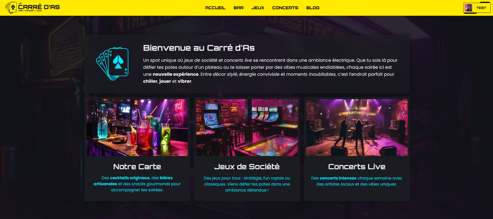

# IPSSI Projet Web



- DAUDEL Clarisse
- RANQUE Yanis
- CASTEL Maxime
- TONELLO Hugo

## Requirements

- [node >=20](https://nodejs.org/en)
- [pnpm](https://pnpm.io/installation)

## Structure

- front (`apps/app`)
  - [SolidStart](https://docs.solidjs.com/solid-start) - Un framework basé sur SolidJS
- back (`apps/server`)
  - [fastify](https://fastify.dev/) - Web framwork pour NodeJS
  - `ATTENTION`: La base de donnée n'est pas persistante, elle s'efface a chaque arret du serveur, il y a un utilisateur par defaut: `admin@lecarredas.com` - `admin`
  - Vous pouvez debug le server avec l'extension `rest-client` dans VSCode (elle est dans les suggestions du repo), il y a un fichier `/apps/server/test.http` avec quelques requetes
- integration (`apps/client`)
  - Site en HTML/CSS "vanilla" pour faciliter l'integration des differentes productions dans SolidStart (`app`)

## Development

```bash
pnpm i
```

```bash
pnpm dev
```

## Production

```bash
pnpm i
```

```bash
pnpm build
```

```bash
pnpm start
```
